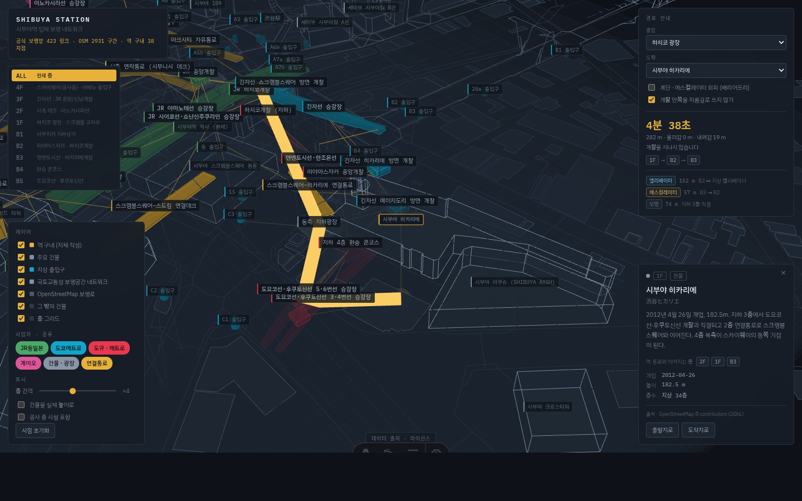

# shibuya-map

시부야역 주변의 건물·개찰·연결통로를 **실제 미터 좌표** 위에서 층별로 보여주고,
두 지점 사이의 보행 경로를 층 이동까지 포함해 안내하는 웹 지도.



- 좌표계: 시부야역 중심(35.658034, 139.701636) 기준 로컬 ENU 평면, 단위는 미터
- 그래프: 노드 3,300 / 엣지 3,900 규모, 지하 5층(B5) ~ 지상 4층(4F)
- 경로 탐색: 다익스트라, 비용은 **보행 시간(초)**. 계단·에스컬레이터·엘리베이터를 따로 모델링
- 배리어프리 모드: 계단·에스컬레이터를 빼고 엘리베이터·평지만 사용
- 개찰 안/밖 구분: 개찰 안쪽을 지름길로 쓰지 않는 경로도 찾을 수 있음

## 데이터 출처

| 레이어 | 출처 | 라이선스 |
|---|---|---|
| 옥외 보행 네트워크 (노드 860 / 링크 982) | 국토교통성 [歩行者移動支援サービスに関するデータサイト](https://www.hokoukukan.go.jp/metadata/detail/65) — 歩行空間ネットワークデータ（渋谷地区） | 정부표준이용규약 제2.0판 |
| 시설 데이터 | 위와 동일 | 정부표준이용규약 제2.0판 |
| 건물 발자국 · 승강장 형상 · 실내 보행로 · 궤도 · 지상 출입구 | [OpenStreetMap](https://www.openstreetmap.org/) (Overpass API) | ODbL 1.0 |
| 역 구내 레이어 (개찰 · 승강장 · 연락통로) | 본 프로젝트 자체 작성 | — |

### 시부야역 실내지도 오픈데이터에 대해

조사 결과(2026-08-30 기준), **시부야역의 실내지도 오픈데이터는 공개되어 있지 않다.**
국토교통성 「屋内地図オープンデータ」로 실제 공개된 지구는 G공간정보센터 CKAN 기준
도쿄역 주변 · 신주쿠역 주변 · 신요코하마역 · 요코하마국제종합경기장 · 나리타공항 ·
나고야 지하가 등 11건이며 시부야는 포함되지 않는다.

공개돼 있는 것은 **옥외** 보행공간 네트워크(渋谷地区)뿐이고, 이 데이터는

- `in_out` 이 전 노드 1 = 전부 옥외
- `floor` 값이 0 / 0.5 / 1 세 종류뿐 (지하 레벨 없음)
- 링크가 전부 2점 직선

이라 역 구내의 입체 구조를 표현할 수 없다.
그래서 이 프로젝트는 **2계층 모델**을 쓴다.

```
official  ── 국토교통성 보행망 + OSM 건물/승강장/실내 보행로   … 출처 검증 가능
curated   ── 역 구내(개찰·승강장·연락통로·수직동선)             … 자체 작성
```

`curated` 레이어도 좌표는 최대한 실측에 앵커링했다.
승강장 중심선은 OSM 궤도(`railway=rail|subway`)와 승강장 폴리곤에서,
개찰 위치는 OSM `train_station_entrance` / `indoor=corridor` 에서 가져왔다.
그래도 **공식 데이터가 아니므로** 모든 피처에 `provenance` 를 붙여 UI 에서 구분해 표시한다.

## 모델링 메모

### 건물은 층마다 접속점을 갖는다

건물을 1층짜리 점으로 두면 「3층 데크로 들어와 지하 개찰로 나가는」 동선이 표현되지
않는다. 그래서 주요 건물마다 바깥과 이어지는 층(`connectLevels`)을 선언하고, 층마다
노드를 하나씩 만든 뒤 그 사이를 건물 내부 수직 동선(엘리베이터·에스컬레이터)으로
잇는다. 예를 들어 스크램블스퀘어 동동은 3F·2F·1F·B2 네 곳에서 바깥과 이어진다.

경로 탐색은 지점이 가진 **모든 노드**를 출발·도착 후보로 놓는 다중 시작 다익스트라라,
같은 건물이라도 그때그때 가장 빠른 층으로 들고 난다.

### 개찰 안 / 개찰 밖

승강장과 개찰 안 콘코스만 `paid` 로 표시하고(개찰 자체는 경계라 제외), 한쪽 끝이
`paid` 인 링크를 「개찰 안쪽을 지나는 링크」로 본다. 승강장이 바깥 보도에 바로
접합되지 않도록 레이어 접합에서도 제외한다.

「개찰 안쪽을 지름질로 쓰지 않기」 옵션은 경로의 구역 순서를 `안* 밖* 안*` 으로
제한한다. 출발·도착이 승강장이면 나오고 들어가는 것 자체는 피할 수 없으므로
한 번씩만 허용하고, 중간에 다시 들어갔다 나오는 경로를 막는다.
둘 다 개찰 밖이면 개찰 안을 아예 쓰지 않는다. (노드 × 3단계 다익스트라)

### 명칭 표기

ハチ公 → 하치코, 田園都市線 → 덴엔토시선처럼 관용 표기를 따른다.
`口` 는 시설 이름일 때 「○ 출입구」(西口 → 서 출입구), 방면을 가리킬 때
「○측」(西口連絡通路 → 서측 연락통로)으로 옮긴다.

## 개발

```bash
pnpm install
pnpm data:fetch   # 원본 오픈데이터 취득 → data/raw (해시·취득일시를 sources.json 에 기록)
pnpm data:build   # data/raw → data/build/map.json, public/data/map.json
pnpm dev
pnpm test         # 투영 정확도 · 그래프 연결성 · 경로 탐색
pnpm build        # data:build → astro check → astro build
```

`data/raw` 는 저장소에 커밋되어 있어 네트워크 없이도 빌드가 재현된다.
`pnpm data:fetch` 는 갱신할 때만 돌리면 된다.
(일부 환경에서 Node 의 fetch 가 Overpass 로 붙지 못해, 실패 시 `curl` 로 폴백한다.)

## 구조

```
data/raw/          원본 그대로 (재현성)
data/build/        생성물
scripts/fetch.ts   원본 취득
scripts/build.ts   투영 · 병합 · 접합 · 검증
src/lib/geo.ts     로컬 ENU 투영
src/lib/levels.ts  층 정의와 근사 표고
src/lib/graph.ts   다익스트라
src/lib/scene.ts   three.js 씬
src/data/curated/  역 구내 레이어 · 주요 건물 표
src/components/    Svelte UI
```

## 링크로 상태 공유

```
?level=-3&sel=gate-ty-miyachuo&from=plat-jr-yamanote&to=plat-ginza&bf=1&np=1&planned=1&h=1&ex=4
```

| 파라미터 | 뜻 |
|---|---|
| `level` | 활성 층 (1F=1, B1=-1) |
| `sel` | 선택된 지점 id |
| `from` / `to` | 경로 출발 · 도착 지점 id |
| `bf` | 1이면 배리어프리 경로 |
| `np` | 1이면 개찰 안쪽을 지름길로 쓰지 않음 |
| `planned` | 1이면 공사 중 시설 포함 |
| `h` | 1이면 건물을 실제 높이로 표시 |
| `ex` | 층 간격 배율 (1–8) |

## 알려진 한계

- `curated` 레이어의 개찰·광장은 대표점 하나로 축약돼 있어, 그 지점을 지나는
  경로의 거리는 실제 도보 거리보다 짧게 나올 수 있다. 건물은 층마다 접속점이
  있지만 평면 위치는 여전히 발자국 중심점 하나다.
- OSM 실내 보행로에는 개찰 안/밖 표시가 없어, 개찰 구분은 `curated` 링크에만
  적용된다.
- 층 표고(`src/lib/levels.ts`)는 공개 단면도가 없어 근사값이다.
- OSM 의 `level` 태그는 시부야에서 철도 시설은 일본식 층 번호, 일부 상업시설은
  지상=0 관례가 섞여 있다. 0 을 지상(1F)으로 정규화해 쓴다.
- 공사 중 시설(스카이웨이 등)의 위치는 공표된 개념도 수준의 근사다.
